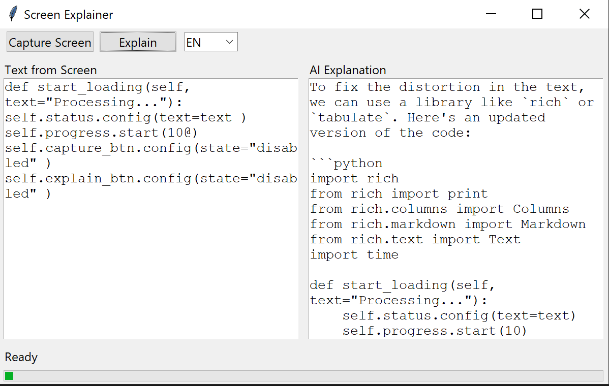

# 🧠 Screen Explainer

Screen Explainer — это инструмент, который позволяет:

* 📸 сделать скриншот
* 🔍 извлечь текст (OCR)
* 🤖 получить объяснение с помощью локальной AI-модели

---

## 🚀 Возможности

* Поддержка кода, сайтов и статей
* OCR через Tesseract
* Локальная AI (Ollama)
* Поддержка RU / EN
* Удобный GUI (Tkinter)
* Индикатор загрузки

---

## 🖥️ Пример



---

## ⚙️ Установка

### 1. Клонировать репозиторий

```bash
git clone https://github.com/USERNAME/screen-explainer.git
cd screen-explainer
```

---

### 2. Установить зависимости

```bash
pip install -r requirements.txt
```

---

### 3. Установить Tesseract

Скачать:
https://github.com/tesseract-ocr/tesseract

Указать путь в `ocr.py`:

```python
pytesseract.pytesseract.tesseract_cmd = r"C:\Program Files\Tesseract-OCR\tesseract.exe"
```

---

### 4. Установить Ollama

https://ollama.com

Запустить модель:

```bash
ollama run llama3.2:1b
```

---

## ▶️ Запуск

```bash
python main.py
```

---

## 🌐 Язык

Можно выбрать язык ответа:

* RU — русский
* EN — английский

---

## ⚠️ Ограничения

* Качество зависит от OCR
* Маленькие модели (1B) могут давать ошибки
* Лучше использовать модели 7B+

---

## 🧩 Технологии

* Python
* Tkinter
* OpenCV
* Tesseract OCR
* Ollama (LLM)

---

## 📜 Лицензия

MIT License
